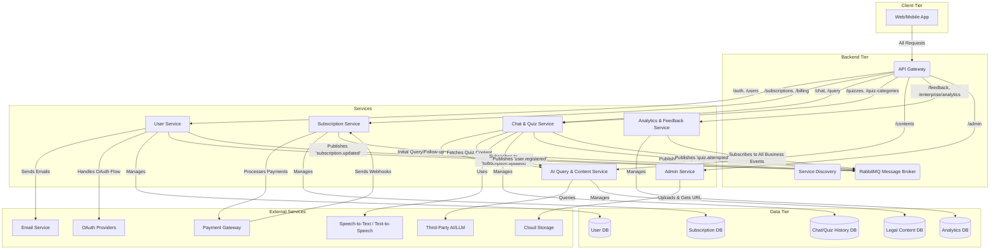

---

# LawGen Backend API & Microservices Documentation

This document serves as the authoritative technical specification for the LawGen backend. It details the microservices architecture, defines all external APIs consumed by the frontend (Web and Mobile applications), and specifies internal APIs for inter-service communication. This `README.md` is the **primary reference for all developers (backend and frontend)** to ensure seamless integration and consistent understanding of API contracts, expected requests, successful responses, and common error patterns.

## Table of Contents

1.  [Introduction and Overview](#1-introduction-and-overview)
2.  [Microservices Architecture Overview](#2-microservices-architecture-overview)
3.  [API Gateway (B) - Entry Point & General API Principles](#3-api-gateway-b---entry-point--general-api-principles)
    *   [General Request & Response Structure](#general-request--response-structure)
    *   [Authentication & Authorization](#authentication--authorization)
    *   [Common Error Responses](#common-error-responses)
4.  [External APIs (Client to API Gateway)](#4-external-apis-client-to-api-gateway)
    *   [4.1. User Management & Authentication (User Service - C)](#41-user-management--authentication-user-service---c)
    *   [4.2. Subscription Management (Subscription Service - D)](#42-subscription-management-subscription-service---d)
    *   [4.3. AI Query & Chat (Chat & Quiz Service - F)](#43-ai-query--chat-chat--quiz-service---f)
    *   [4.4. Quizzes (Chat & Quiz Service - F)](#44-quizzes-chat--quiz-service---f)
    *   [4.5. Content Browsing (AI Query & Content Service - E)](#45-content-browsing-ai-query--content-service---e)
    *   [4.6. Analytics & Feedback (Analytics & Feedback Service - H)](#46-analytics--feedback-analytics--feedback-service---h)
        *   [4.6.1. Internal Dev Feedback](#461-internal-dev-feedback)
        *   [4.6.2. Enterprise Analytics Access](#462-enterprise-analytics-access)
    *   [4.7. Admin Endpoints (Admin Service - I)](#47-admin-endpoints-admin-service---i)
5.  [Internal APIs (Service-to-Service Communication)](#5-internal-apis-service-to-service-communication)
    *   [5.1. Synchronous Calls via Service Discovery](#51-synchronous-calls-via-service-discovery)
    *   [5.2. Asynchronous Event-Driven Communication (RabbitMQ Message Broker - RMQ)](#52-asynchronous-event-driven-communication-rabbitmq-message-broker---rmq)
6.  [Third-Party Integrations](#6-third-party-integrations)
    *   [6.1. Third-Party AI/LLM (J)](#61-third-party-aillm-j)
    *   [6.2. Speech-to-Text / Text-to-Speech (K)](#62-speech-to-text--text-to-speech-k)
    *   [6.3. Payment Gateway (L)](#63-payment-gateway-l)
    *   [6.4. Email Service (M)](#64-email-service-m)
    *   [6.5. Cloud Storage (N - for PDFs)](#65-cloud-storage-n---for-pdfs)
    *   [6.6. OAuth Providers (O - e.g., Google)](#66-oauth-providers-o---eg-google)
7.  [Data Models (Detailed)](#7-data-models-detailed)
8.  [Development Guidelines & Expectations](#8-development-guidelines--expectations)

---

### 1. Introduction and Overview

**LawGen** aims to provide AI-powered legal assistance for Ethiopia, addressing the significant challenge of limited access to understandable legal information for over 110 million people. The application serves as a legal information assistant, allowing users to ask questions in Amharic or English, retrieving relevant Ethiopian laws, and generating simple, easy-to-understand summaries.

This document serves as the foundational contract for all development efforts. Backend developers will use it to ensure their services correctly implement the defined API contracts. Frontend developers will rely on it to build robust user interfaces that accurately interact with the backend, handle responses, and gracefully manage errors.

**Key Principles for this Documentation:**

*   **Single Source of Truth:** This `README.md` is the definitive reference for all API specifications.
*   **Clarity & Precision:** Every endpoint, request, successful response, and error scenario must be clearly defined.
*   **Consistency:** All services must adhere to the defined authentication, authorization, and error handling patterns.
*   **Seamless Integration:** The details provided here are crucial for enabling different development teams to work in parallel and integrate their components effortlessly.

### 2. Microservices Architecture Overview

The LawGen application leverages a microservices architecture for scalability, resilience, and independent deployment. The system is conceptually divided into Client, Backend, Data, and External Services tiers. Communication is managed through an API Gateway, Service Discovery, and a Message Broker (RabbitMQ).



### 3. API Gateway (B) - Entry Point & General API Principles

The API Gateway is the single point of entry for all external (client-facing) requests. It is responsible for routing requests to the appropriate backend service, handling initial authentication, and enforcing rate limits.

*   **Base URL:** `https://api.lawgen.et` (Production)
*   **Development Base URL:** `http://localhost:8080` (Example, port may vary)

#### General Request & Response Structure

*   **Request Headers:**
    *   `Content-Type: application/json` for all `POST`, `PUT`, `PATCH` requests (unless `multipart/form-data` for file uploads).
    *   `Authorization: Bearer <JWT_TOKEN>` for authenticated endpoints.
    *   `Accept-Language: en` or `am` (optional, for explicit language preference for content/AI responses).
*   **Successful Responses (2xx):**
    *   `Content-Type: application/json`
    *   Generally return a JSON object with the requested data or a confirmation message.
    *   All listing APIs (returning an array of items) **must** conform to the paginated response structure:
        ```json
        {
          "items": [ /* array of resource objects */ ],
          "total_items": 100,
          "total_pages": 10,
          "current_page": 1,
          "page_size": 10
        }
        ```
    *   Empty bodies for `204 No Content` where appropriate (e.g., successful delete).

#### Authentication & Authorization

*   **Authentication Mechanism:** JWT (JSON Web Tokens) for traditional login, and OAuth 2.0 for third-party providers.
    *   Upon successful traditional login/registration, the API Gateway (via User Service) issues an `access_token` (short-lived, ~15-60 min) and a `refresh_token` (longer-lived, ~7 days).
    *   For OAuth, the User Service handles the redirect flow and, upon successful authorization and user creation/login, generates LawGen's own JWTs.
    *   The `access_token` must be included in the `Authorization` header as `Bearer <access_token>` for all protected endpoints.
    *   The `refresh_token` is used to obtain a new `access_token` when the current one expires, via the `/auth/refresh` endpoint.
*   **Authorization:**
    *   The API Gateway performs initial JWT validation.
    *   User roles (e.g., `user`, `admin`, `enterprise_user`) are embedded in the JWT payload or retrieved by downstream services.
    *   Services perform granular authorization checks (e.g., "only an admin can update content", "an enterprise_user can access analytics").

#### Common Error Responses

All error responses from the API Gateway and backend services will adhere to a consistent JSON structure:

```json
{
  "code": "ERROR_CODE",
  "message": "A human-readable description of the error.",
  "details": {
    "field_name": "Specific error related to this field" // Optional, for validation errors
  }
}
```

| HTTP Status Code | Error Code         | Message (Example)                          | Description                                                                 |
| :--------------- | :----------------- | :----------------------------------------- | :-------------------------------------------------------------------------- |
| `400 Bad Request`  | `INVALID_INPUT`    | "Invalid email format."                    | Request body/parameters are malformed or fail validation.                   |
|                  | `MISSING_FIELD`    | "Required field 'password' is missing."    | A mandatory field was not provided.                                         |
| `401 Unauthorized` | `AUTHENTICATION_FAILED` | "Invalid credentials."                     | Failed login, incorrect password, or invalid OAuth state/token.             |
|                  | `UNAUTHORIZED`     | "Missing or invalid access token."         | Token not provided, expired, or malformed.                                  |
| `403 Forbidden`    | `ACCESS_DENIED`    | "You do not have permission to perform this action." | Authenticated user lacks the necessary role or permissions.                 |
| `404 Not Found`    | `NOT_FOUND`        | "Resource not found."                      | The requested resource (e.g., user, content ID) does not exist.             |
| `409 Conflict`     | `DUPLICATE_RESOURCE` | "Email already registered."                | Attempt to create a resource that already exists (e.g., unique constraint). |
| `429 Too Many Requests` | `RATE_LIMIT_EXCEEDED` | "Too many requests, please try again later." | User has exceeded the allowed rate limit for requests.                      |
| `500 Internal Server Error` | `SERVER_ERROR`     | "An unexpected error occurred."            | A generic server-side error. Detailed errors logged internally.             |
| `503 Service Unavailable` | `SERVICE_UNAVAILABLE` | "Service is temporarily unavailable."      | Upstream service is down or overloaded.                                     |

---

### 4. External APIs (Client to API Gateway)

These are the public-facing APIs consumed directly by the Web and Mobile applications via the API Gateway.

#### 4.1. User Management & Authentication (Routed to User Service - C)

| Endpoint                   | Method | Description                                  | Request Body (Example)                               | **Success Response (20x)**                               | **Error Response (40x, 500)**                                |
| :------------------------- | :----- | :------------------------------------------- | :--------------------------------------------------- | :------------------------------------------------------- | :----------------------------------------------------------- |
| `/auth/register`           | `POST` | Register a new user (email/password)         | `{"first_name": "John", "last_name": "Doe", "email": "user@example.com", "password": "securepassword", "birth_date": "1990-01-15", "gender": "male", "profile_picture_url": "http://example.com/pic.jpg"}` | `201 Created` `{"message": "User registered successfully."}`           | `400 INVALID_INPUT`, `409 DUPLICATE_RESOURCE` (`email` already exists) |
| `/auth/login`              | `POST` | Authenticate user and get tokens (email/password) | `{"email": "user@example.com", "password": "securepassword"}` | `200 OK` `{"access_token": "jwt_token", "refresh_token": "refresh_token", "user": {"id": "uuid", "first_name": "John", "last_name": "Doe", "email": "user@example.com", "birth_date": "1990-01-15", "gender": "male", "profile_picture_url": "http://example.com/pic.jpg", "subscription_status": "free", "role": "user"}}}` | `401 AUTHENTICATION_FAILED`                                |
| `/auth/refresh`            | `POST` | Refresh access token                         | `{"refresh_token": "refresh_token"}`                 | `200 OK` `{"access_token": "new_jwt_token"}`                   | `401 UNAUTHORIZED` (`refresh_token` invalid/expired)       |
| `/auth/google`             | `GET`  | Initiate Google OAuth flow                   | *(None)*                                             | `302 Redirect` to Google's authentication page           | `500 SERVER_ERROR` (OAuth configuration issue)               |
| `/auth/google/callback`    | `GET`  | OAuth callback from Google                   | `?code=auth_code&state=oauth_state` (backend receives this directly) | `302 Redirect` to client with encrypted payload (`https://frontend.lawgen.et/oauth/callback?payload=encrypted_code_and_state`) | `302 Redirect` to client with error (`https://frontend.lawgen.et/oauth/error?code=AUTHENTICATION_FAILED`) |
| `/auth/register_google`    | `POST` | Finalize Google OAuth registration/login     | `{"payload": "encrypted_code_and_state", "first_name": "OptionalFirstName", "last_name": "OptionalLastName", "birth_date": "OptionalBirthDate", "gender": "OptionalGender", "profile_picture_url": "OptionalProfilePicUrl"}` | `200 OK` `{"access_token": "jwt_token", "refresh_token": "refresh_token", "user": {"id": "uuid", "first_name": "John", "last_name": "Doe", "email": "user@example.com", "birth_date": "1990-01-15", "gender": "male", "profile_picture_url": "http://example.com/pic.jpg", "subscription_status": "free", "role": "user"}}}` | `400 INVALID_INPUT` (invalid payload), `401 AUTHENTICATION_FAILED` (Google token exchange failed), `409 DUPLICATE_RESOURCE` |
| `/users/me`                | `GET`  | Get current user's profile                   | *(Auth Header)*                                      | `200 OK` `{"id": "uuid", "first_name": "John", "last_name": "Doe", "email": "user@example.com", "birth_date": "1990-01-15", "gender": "male", "profile_picture_url": "http://example.com/pic.jpg", "language_preference": "en", "subscription_status": "free", "role": "user"}` | `401 UNAUTHORIZED`, `404 NOT_FOUND`                          |
| `/users/me`                | `PUT`  | Update current user's profile                | `{"first_name": "Jonathan", "profile_picture_url": "http://example.com/new_pic.jpg", "gender": "male"}` | `200 OK` `{"message": "Profile updated successfully."}`          | `400 INVALID_INPUT`, `401 UNAUTHORIZED`                      |
| `/users/me/password`       | `PUT`  | Change user's password (for email/password users) | `{"old_password": "old_pw", "new_password": "new_pw"}` | `200 OK` `{"message": "Password updated successfully."}`         | `400 INVALID_INPUT`, `401 AUTHENTICATION_FAILED` (old password incorrect) |
| `/auth/forgot-password`    | `POST` | Initiate password reset (send OTP)           | `{"email": "user@example.com"}`                      | `200 OK` `{"message": "OTP sent to registered email/phone."}`  | `400 INVALID_INPUT`, `404 NOT_FOUND` (user not found), `429 RATE_LIMIT_EXCEEDED` |
| `/auth/verify-otp`         | `POST` | Verify OTP for password reset                | `{"email": "user@example.com", "otp_code": "123456"}` | `200 OK` `{"message": "OTP verified successfully.", "reset_token": "temp_reset_jwt_token"}` | `400 INVALID_INPUT`, `401 AUTHENTICATION_FAILED` (OTP invalid/expired/max retries), `404 NOT_FOUND` |
| `/auth/reset-password`     | `POST` | Set new password with reset token            | `{"reset_token": "temp_reset_jwt_token", "new_password": "new_secure_password"}` | `200 OK` `{"message": "Password reset successfully. Please log in."}` | `400 INVALID_INPUT`, `401 UNAUTHORIZED` (reset_token invalid/expired) |

#### 4.2. Subscription Management (Routed to Subscription Service - D)

| Endpoint                     | Method | Description                                       | Request Body (Example)                                 | **Success Response (20x)**                                    | **Error Response (40x, 500)**                                    |
| :--------------------------- | :----- | :------------------------------------------------ | :----------------------------------------------------- | :------------------------------------------------------------ | :---------------------------------------------------------------- |
| `/subscriptions/plans`       | `GET`  | Get all available subscription plans              | *(Auth Header optional for public plans)*             | `200 OK` `{"items": [{"id": "plan_id_1", "name": "Basic", "price": 100}], "total_items": 2, "total_pages": 1, "current_page": 1, "page_size": 10}` | `500 SERVER_ERROR`                                                |
| `/subscriptions/subscribe`   | `POST` | Initiate a subscription checkout session          | `{"plan_id": "plan_id_1"}`                             | `200 OK` `{"checkout_url": "https://payment.gateway/checkout/..."}` | `400 INVALID_INPUT`, `401 UNAUTHORIZED`, `404 NOT_FOUND` (plan not found) |
| `/subscriptions/me`          | `GET`  | Get current user's subscription status and details | *(Auth Header)*                                        | `200 OK` `{"status": "active", "plan_id": "plan_id_1", "start_date": "2023-01-01", "end_date": "2024-01-01"}` | `401 UNAUTHORIZED`, `404 NOT_FOUND` (no active subscription)      |
| `/subscriptions/cancel`      | `POST` | Cancel current user's subscription                | *(Auth Header)*                                        | `200 OK` `{"message": "Subscription cancelled successfully."}`      | `401 UNAUTHORIZED`, `404 NOT_FOUND` (no active subscription)      |
| `/billing/webhook`           | `POST` | **Internal:** Webhook for payment gateway callbacks | *(Payment Gateway specific payload)*                   | `200 OK` `{"status": "received"}` (Internal handling, no client call) | `400 INVALID_INPUT` (invalid webhook signature/payload)           |

#### 4.3. AI Query & Chat (Routed to Chat & Quiz Service - F)

| Endpoint | Method | Description | Request Body (Example) | **Success Response (20x)** | **Error Response (40x, 500)** |
| :--- | :--- | :--- | :--- | :--- | :--- |
| `/chat/query` | `POST` | Submit a new legal query to start a chat session. | `{"question": "How do inheritance laws work in Ethiopia?", "language": "en"}` | `200 OK` `{"sessionId": "new_session_id", "response": {"summary": "Under Ethiopian Civil Code...", "sources": ["Article 842 Civil Code"]}}` | `400 INVALID_INPUT`, `401 UNAUTHORIZED`, `500 SERVER_ERROR` |
| `/chat/sessions` | `GET` | Get user's chat history (a list of all chat sessions). | `?page=1&limit=10` | `200 OK` `{"items": [{"id": "chat_session_1", "title": "Inheritance laws in Ethiopia", "timestamp": "2023-10-26T10:30:00Z"}, {"id": "chat_session_2", "title": "Requirements for forming a business", "timestamp": "..."}], "total_items": 2, "total_pages": 1, "current_page": 1, "page_size": 10}` | `401 UNAUTHORIZED` |
| `/chat/sessions/{sessionId}` | `GET` | Get the full conversation for a specific chat session. | *(Auth Header)* | `200 OK` `{"id": "chat_session_1", "title": "Inheritance laws...", "messages": [{"role": "user", "content": "How do inheritance laws..."}, {"role": "ai", "content": "Under Ethiopian Civil Code...", "sources": [...]}, {"role": "user", "content": "Explain Article 842 further."}]}` | `401 UNAUTHORIZED`, `404 NOT_FOUND` |
| `/chat/sessions/{sessionId}/followup` | `POST` | Submit a follow-up question within an existing chat session. | `{"followup_question": "Explain Article 842 further."}` | `200 OK` `{"summary": "Article 842 specifies...", "sources": ["Article 842 Civil Code"]}` | `400 INVALID_INPUT`, `401 UNAUTHORIZED`, `404 NOT_FOUND` (sessionId invalid), `500 SERVER_ERROR` |

#### 4.4. Quizzes (Chat & Quiz Service - F)

**Frontend Logic:** Frontend will fetch quiz categories, then quizzes within a chosen category. When a quiz is selected, the frontend retrieves the full quiz data (including all questions and their correct answers). The frontend then handles all quiz presentation, user interaction, answer validation, and scoring locally.

| Endpoint                 | Method | Description                                     | Request Body (Example)                               | **Success Response (20x)**                                                                                                                                                                                                                                                         | **Error Response (40x, 500)**                                  |
| :----------------------- | :----- | :---------------------------------------------- | :--------------------------------------------------- | :--------------------------------------------------------------------------------------------------------------------------------------------------------------------------------------------------------------------------------------------------------------------------------- | :------------------------------------------------------------- |
| `/quiz-categories`       | `GET`  | Get list of available quiz categories           | `?page=1&limit=10`                                   | `200 OK` `{"items": [{"id": "cat_1", "name": "Level 1"}, {"id": "cat_2", "name": "Level 2"}], "total_items": 5, "total_pages": 1, "current_page": 1, "page_size": 10}`                                                                                                                  | `401 UNAUTHORIZED`                                             |
| `/quiz-categories/{categoryId}/quizzes` | `GET`  | Get quizzes for a specific category             | `?page=1&limit=10`                                   | `200 OK` `{"items": [{"id": "quiz_id_1", "name": "Inheritance Law Basics", "description": "Test your knowledge of Ethiopian inheritance laws."}, {"id": "quiz_id_2", "name": "Contract Law"}], "total_items": 20, "total_pages": 2, "current_page": 1, "page_size": 10}` | `401 UNAUTHORIZED`, `404 NOT_FOUND` (category_id invalid), `400 INVALID_INPUT` |
| `/quizzes/{quizId}`      | `GET`  | Get a specific quiz with all questions and answers | *(Auth Header)*                                      | `200 OK` `{"id": "quiz_id_1", "name": "Inheritance Law Basics", "description": "...", "questions": [{"q_id": "q1", "text": "Who inherits property if there is no will?", "options": {"A": "Spouse only", "B": "Children equally", "C": "State", "D": "Eldest son"}, "correct_option": "B"}, {"q_id": "q2", "text": "...", "options": {"A":"Yes","B":"No"}, "correct_option": "A"}]}` | `401 UNAUTHORIZED`, `404 NOT_FOUND` (quizId invalid)           |

#### 4.5. Content Browsing (AI Query & Content Service - E)

**Frontend Logic:** Frontend makes one API call to `/contents` (with optional pagination and search for titles). It then displays the listed contents. When a specific content is clicked, the frontend uses its `url` to redirect the user to the PDF directly.

| Endpoint           | Method | Description                                   | Request Body (Example)             | **Success Response (20x)**                                                                                                       | **Error Response (40x, 500)**                       |
| :----------------- | :----- | :-------------------------------------------- | :--------------------------------- | :----------------------------------------------------------------------------------------------------------------------- | :-------------------------------------------------- |
| `/contents`        | `GET`  | Get all legal contents (paginated, searchable) | `?page=1&limit=10&search=property` | `200 OK` `{"items": [{"id": "doc_1", "name": "Article 842 - Inheritance", "url": "https://storage.cloud/pdf/doc1.pdf"}, {"id": "doc_2", "name": "Marriage Proclamation", "url": "https://storage.cloud/pdf/doc2.pdf"}], "total_items": 50, "total_pages": 5, "current_page": 1, "page_size": 10}` | `400 INVALID_INPUT` (invalid page/limit/search)        |

#### 4.6. Analytics & Feedback (Analytics & Feedback Service - H)

This service manages both internal developer feedback and aggregated analytics for enterprise users.

##### 4.6.1. Internal Dev Feedback

This endpoint is for internal developers to submit system-related feedback (bugs, crashes, feature requests for the dev team).

| Endpoint     | Method | Description               | Request Body (Example)                          | **Success Response (20x)**                 | **Error Response (40x, 500)**                      |
| :----------- | :----- | :------------------------ | :---------------------------------------------- | :----------------------------------------- | :------------------------------------------------- |
| `/feedback`  | `POST` | Submit internal dev feedback | `{"submitter_user_id": "admin_uuid", "type": "bug_report", "description": "Crash on login for Android 12", "severity": "High"}` | `200 OK` `{"message": "Feedback submitted."}` | `400 INVALID_INPUT`, `401 UNAUTHORIZED` (Admin only or specific dev role) |

##### 4.6.2. Enterprise Analytics Access

These endpoints allow authenticated `enterprise_user` roles to access aggregated analytical data on user query trends, including demographic breakdowns.

| Endpoint                         | Method | Description                                       | Request Body (Example)                               | **Success Response (20x)**                                       | **Error Response (40x, 500)**                                          |
| :------------------------------- | :----- | :------------------------------------------------ | :--------------------------------------------------- | :--------------------------------------------------------------- | :--------------------------------------------------------------------- |
| `/enterprise/analytics/query-trends` | `GET`  | Get top queried keywords and topics (aggregated) | `?start_date=2023-01-01&end_date=2023-12-31&limit=10` | `200 OK` `{"keywords": [{"term": "inheritance", "count": 150, "demographics": {"male": 70, "female": 80, "age_ranges": {"18-24": 30, "25-34": 50}}}, {"term": "property rights", "count": 120, "demographics": {"male": 60, "female": 60, "age_ranges": {"35-44": 40}}}], "topics": [{"name": "Family Law", "count": 200, "demographics": {"male": 100, "female": 100, "age_ranges": {"25-34": 70, "35-44": 80}}}, {"name": "Contracts", "count": 180, "demographics": {"male": 90, "female": 90, "age_ranges": {"25-34": 60, "45-54": 50}}}]}` | `401 UNAUTHORIZED`, `403 ACCESS_DENIED` (not enterprise user), `400 INVALID_INPUT` |

#### 4.7. Admin Endpoints (Admin Service - I)

*These endpoints require elevated administrative privileges (`role: "admin"`) and will return `403 Forbidden` for unauthorized users.*

##### 4.7.1. Admin - User Management

| Endpoint                   | Method | Description                       | Request Body (Example)                                | **Success Response (20x)**                              | **Error Response (40x, 500)**                               |
| :------------------------- | :----- | :-------------------------------- | :---------------------------------------------------- | :------------------------------------------------------ | :---------------------------------------------------------- |
| `/admin/users`             | `GET`  | Get all users (paginated)         | `?page=1&limit=10&search=John`                        | `200 OK` `{"items": [{"id": "uuid", "first_name": "...", "last_name": "...", "email": "...", "birth_date": "...", "gender": "...", "profile_picture_url": "...", "role": "user"}], "total_items": 50, "total_pages": 5, "current_page": 1, "page_size": 10}` | `401 UNAUTHORIZED`, `403 ACCESS_DENIED`, `400 INVALID_INPUT` |
| `/admin/users/{userId}`    | `PUT`  | Update user details               | `{"role": "admin", "status": "active"}`               | `200 OK` `{"message": "User updated."}`                   | `400 INVALID_INPUT`, `401 UNAUTHORIZED`, `403 ACCESS_DENIED`, `404 NOT_FOUND` |
| `/admin/users/{userId}`    | `DELETE` | Delete a user                     | *(Auth Header, Admin Role)*                           | `204 No Content`                                        | `401 UNAUTHORIZED`, `403 ACCESS_DENIED`, `404 NOT_FOUND`    |

##### 4.7.2. Admin - Quiz Category Management (CRUD)

| Endpoint                      | Method | Description                          | Request Body (Example)             | **Success Response (20x)**                               | **Error Response (40x, 500)**                               |
| :---------------------------- | :----- | :----------------------------------- | :--------------------------------- | :------------------------------------------------------- | :---------------------------------------------------------- |
| `/admin/quiz-categories`      | `POST` | Create a new quiz category           | `{"name": "Advanced Law"}`         | `201 Created` `{"message": "Category created.", "id": "cat_id"}` | `400 INVALID_INPUT`, `401 UNAUTHORIZED`, `403 ACCESS_DENIED`, `409 DUPLICATE_RESOURCE` |
| `/admin/quiz-categories`      | `GET`  | Get all quiz categories (paginated)  | `?page=1&limit=10`                 | `200 OK` `{"items": [{"id": "cat_1", "name": "Level 1"}], "total_items": 5, "total_pages": 1, "current_page": 1, "page_size": 10}` | `401 UNAUTHORIZED`, `403 ACCESS_DENIED`, `400 INVALID_INPUT` |
| `/admin/quiz-categories/{categoryId}` | `PUT`  | Update a quiz category               | `{"name": "Expert Law"}`           | `200 OK` `{"message": "Category updated."}`              | `400 INVALID_INPUT`, `401 UNAUTHORIZED`, `403 ACCESS_DENIED`, `404 NOT_FOUND` |
| `/admin/quiz-categories/{categoryId}` | `DELETE` | Delete a quiz category               | *(Auth Header, Admin Role)*        | `204 No Content`                                         | `401 UNAUTHORIZED`, `403 ACCESS_DENIED`, `404 NOT_FOUND`, `409 CONFLICT` (if quizzes exist in category) |

##### 4.7.3. Admin - Legal Content Management (PDFs - CRUD)

Admins will upload PDF files to **third-party cloud storage**. The system saves the public URL. `extracted_text_for_ai` will be processed and stored for AI queries. Users view content via the `url`.

| Endpoint                   | Method | Description                                   | Request Body (Example)                                     | **Success Response (20x)**                                           | **Error Response (40x, 500)**                               |
| :------------------------- | :----- | :-------------------------------------------- | :--------------------------------------------------------- | :------------------------------------------------------------------- | :---------------------------------------------------------- |
| `/admin/contents`          | `POST` | Add new legal content (PDF upload)            | `multipart/form-data` with `file` (the PDF), `group_name`, `name`, `description`, `language` | `201 Created` `{"message": "Content added.", "id": "new_id", "url": "https://storage.cloud/pdf/new_id.pdf"}` | `400 INVALID_INPUT`, `401 UNAUTHORIZED`, `403 ACCESS_DENIED`, `500 SERVER_ERROR` (cloud storage/text extraction issue) |
| `/admin/contents`          | `GET`  | Get all legal contents (paginated, searchable) | `?page=1&limit=10&search=marriage`                           | `200 OK` `{"items": [{"id": "doc_1", "name": "...", "url": "..."}, {...}], "total_items": 50, "total_pages": 5, "current_page": 1, "page_size": 10}` | `401 UNAUTHORIZED`, `403 ACCESS_DENIED`, `400 INVALID_INPUT` |
| `/admin/contents/{contentId}` | `PUT`  | Update legal content (metadata or new PDF)    | `multipart/form-data` with optional `file`, `group_name`, `name`, `description`, `language` | `200 OK` `{"message": "Content updated.", "url": "https://storage.cloud/pdf/updated_id.pdf"}` | `400 INVALID_INPUT`, `401 UNAUTHORIZED`, `403 ACCESS_DENIED`, `404 NOT_FOUND` |
| `/admin/contents/{contentId}` | `DELETE` | Delete legal content                          | *(Auth Header, Admin Role)*                                | `204 No Content`                                                     | `401 UNAUTHORIZED`, `403 ACCESS_DENIED`, `404 NOT_FOUND`    |

##### 4.7.4. Admin - Quiz Management (CRUD)

Admins manage static quizzes, including questions, options, and correct answers.

| Endpoint                   | Method | Description                          | Request Body (Example)                                                                                                                                                                                                                                                               | **Success Response (20x)**                                                                                                                                                                                                                                                                                       | **Error Response (40x, 500)**                               |
| :------------------------- | :----- | :----------------------------------- | :------------------------------------------------------------------------------------------------------------------------------------------------------------------------------------------------------------------------------------------------------------------- | :------------------------------------------------------------------------------------------------------------------------------------------------------------------------------------------------------------------------------------------------------------------------------------------------------- | :---------------------------------------------------------- |
| `/admin/quizzes`           | `POST` | Create a new quiz                    | `{"name": "Family Law Basics", "description": "Test basic family law knowledge.", "category_id": "cat_1", "questions": [{"q_id": "q1", "text": "Who is head of household?", "options": {"A": "Husband", "B": "Wife", "C": "Both", "D": "Eldest child"}, "correct_option": "C"}, {"q_id": "q2", "text": "...", "options": {}, "correct_option": ""}]}` | `201 Created` `{"message": "Quiz created successfully.", "id": "new_quiz_id"}`                                                                                                                                                                                                                                | `400 INVALID_INPUT`, `401 UNAUTHORIZED`, `403 ACCESS_DENIED`, `404 NOT_FOUND` (category_id invalid) |
| `/admin/quizzes`           | `GET`  | Get all quizzes (paginated, searchable) | `?page=1&limit=10&category_id=cat_1`                         | `200 OK` `{"items": [{"id": "quiz_id_1", "name": "...", "description": "..."}, {...}], "total_items": 20, "total_pages": 2, "current_page": 1, "page_size": 10}` | `401 UNAUTHORIZED`, `403 ACCESS_DENIED`, `400 INVALID_INPUT` |
| `/admin/quizzes/{quizId}`  | `PUT`  | Update an existing quiz              | `{"name": "Updated Family Law Quiz", "category_id": "cat_2", "questions": [{"q_id": "q1", "text": "...", "options": {}, "correct_option": "B"}]}` (Partial or full update)                                                                                                                                                           | `200 OK` `{"message": "Quiz updated successfully."}`                                                                                                                                                                                                                                                         | `400 INVALID_INPUT`, `401 UNAUTHORIZED`, `403 ACCESS_DENIED`, `404 NOT_FOUND` (quizId or category_id invalid) |
| `/admin/quizzes/{quizId}`  | `DELETE` | Delete a quiz                        | *(Auth Header, Admin Role)*                                                                                                                                                                                                                                                        | `204 No Content`                                                                                                                                                                                                                                                                                       | `401 UNAUTHORIZED`, `403 ACCESS_DENIED`, `404 NOT_FOUND`    |


#### 4.7.5. Admin - Legal Entity Management (CRUD)
Admins can create, read, update, and delete records of legal entities, such as law firms, government bodies (e.g., Ombudsman), and other organizations. These records will be stored and managed directly by the Admin Service.

| Endpoint | Method | Description | Request Body (Example) | Success Response (20x) | Error Response (40x, 500) |
| :--- | :--- | :--- | :--- | :--- | :--- |
| `/admin/legal-entities` | **POST** | Create a new legal entity. | `{"name": "ABC Legal Services LLP", "entity_type": "PRIVATE_LAW_FIRM", "registration_number": "MT/AA/1/0012345/2015", "tin_number": "0098765432", "status": "ACTIVE", "phone": ["+251911234567"], "email": ["contact@abc-legal.com"], "website": "https://www.abc-legal.com/", "city": "Addis Ababa", "sub_city": "Bole", "woreda": "03", "street_address": "DH Geda Tower, 5th Floor", "description": "A leading law firm...", "services_offered": ["Corporate Law", "Litigation"]}` | **201 Created** `{"message": "Legal entity created.", "id": "new_entity_id"}` | `400 INVALID_INPUT`, `401 UNAUTHORIZED`, `403 ACCESS_DENIED`, `409 DUPLICATE_RESOURCE` (e.g., duplicate registration number) |
| `/admin/legal-entities` | **GET** | Get all legal entities (paginated, searchable). | `?page=1&limit=10&search=ABC` | **200 OK** `{"items": [{"id": "entity_1", "name": "ABC Legal...", "entity_type": "PRIVATE_LAW_FIRM", "phone": ["..."], "city": "Addis Ababa"}], "total_items": 15, "total_pages": 2, "current_page": 1, "page_size": 10}` | `401 UNAUTHORIZED`, `403 ACCESS_DENIED`, `400 INVALID_INPUT` |
| `/admin/legal-entities/{entityId}` | **GET** | Get details of a specific legal entity. | (Auth Header, Admin Role) | **200 OK** `{ // Full LegalEntity JSON object }` | `401 UNAUTHORIZED`, `403 ACCESS_DENIED`, `404 NOT_FOUND` |
| `/admin/legal-entities/{entityId}` | **PUT** | Update an existing legal entity. | `{"name": "Updated ABC Legal Services", "sub_city": "Kirkos", "services_offered": ["Corporate Law", "Litigation", "Arbitration"]}` (Partial or full update) | **200 OK** `{"message": "Legal entity updated."}` | `400 INVALID_INPUT`, `401 UNAUTHORIZED`, `403 ACCESS_DENIED`, `404 NOT_FOUND` |
| `/admin/legal-entities/{entityId}` | **DELETE** | Delete a legal entity. | (Auth Header, Admin Role) | **204 No Content** | `401 UNAUTHORIZED`, `403 ACCESS_DENIED`, `404 NOT_FOUND` |

---

### 5. Internal APIs (Service-to-Service Communication)

Internal service communication occurs either synchronously via Service Discovery (for direct requests) or asynchronously via RabbitMQ (for event-driven architectures). **These APIs are not exposed externally.**

#### 5.1. Synchronous Calls via Service Discovery

Services directly call each other, with endpoint resolution handled by the Service Discovery mechanism.

##### 5.1.1. Chat & Quiz Service (F) to AI Query & Content Service (E)

| Endpoint                     | Service Call | Description                                     | Request Body (Example)                               | **Success Response (20x)**                                       | **Error Response (40x, 500)**                                          |
| :--------------------------- | :----------- | :---------------------------------------------- | :--------------------------------------------------- | :--------------------------------------------------------------- | :--------------------------------------------------------------------- |
| `/internal/ai/summarize`     | `F -> E`     | Request AI summary for a *new* legal query.     | `{"user_query": "How does inheritance work?", "relevant_law_text": "Article 842 says...", "language": "en", "disclaimer_prompt": "This is for informational purposes only..."}` | `200 OK` `{"summary": "Under Ethiopian Civil Code...", "sources": ["Article 842 Civil Code"]}` | `400 INVALID_INPUT`, `500 SERVER_ERROR` (AI/LLM integration failure) |
| `/internal/ai/chat`          | `F -> E`     | Request AI response for a *follow-up* query.    | `{"user_query": "Explain Article 123 further.", "chat_history": [{"role": "user", "content": "..."}, {"role": "ai", "content": "..."}], "relevant_law_text": "Article 123 specifies...", "language": "en", "disclaimer_prompt": "This is for informational purposes only..."}` | `200 OK` `{"summary": "Article 123 specifies...", "sources": ["Article 123 Civil Code"]}` | `400 INVALID_INPUT`, `500 SERVER_ERROR` (AI/LLM integration failure) |
| `/internal/content/for-ai/{contentId}` | `F -> E` | Retrieve extracted text for AI from a content ID | *(Path parameter `contentId`)*                       | `200 OK` `{"extracted_text": "Full extracted text for AI processing..."}` | `404 NOT_FOUND` (contentId invalid)                                    |

#### 5.2. Asynchronous Event-Driven Communication (RabbitMQ Message Broker - RMQ)

Services publish events to designated queues/exchanges, and other services subscribe to these events for decoupled communication. This ensures robustness and scalability.

##### General Event Structure

Events are JSON objects.

```json
{
  "event_id": "uuid",
  "event_type": "subscription.updated",
  "timestamp": "2023-10-27T10:00:00Z",
  "source_service": "subscription-service",
  "payload": { /* Event-specific data */ }
}
```

| Event Type                 | Publisher            | Subscribers                  | Payload (Example)                                  | Description                                           |
| :------------------------- | :------------------- | :--------------------------- | :--------------------------------------------------- | :---------------------------------------------------- |
| `subscription.updated`     | `Subscription Service (D)` | `User Service (C)`, `Analytics & Feedback Service (H)` | `{"user_id": "uuid", "plan_id": "plan_id_1", "status": "active", "effective_date": "2023-01-01"}` | Notifies other services when a user's subscription changes (e.g., status, plan). |
| `user.registered`          | `User Service (C)`   | `Analytics & Feedback Service (H)` | `{"user_id": "uuid", "email": "user@example.com", "registration_date": "2023-01-01"}` | Notifies that a new user has successfully registered. |
| `query.analyzed`           | `Chat & Quiz Service (F)` | `Analytics & Feedback Service (H)` | `{"user_id": "uuid", "query_text_raw": "...", "extracted_keywords": ["inheritance", "property"], "topic": "family_law", "timestamp": "...", "language": "en"}` | Collects data for enterprise analytics on queried keywords/topics. |
| `quiz.attempted`           | `Chat & Quiz Service (F)` | `Analytics & Feedback Service (H)` | `{"user_id": "uuid", "quiz_id": "quiz_id_1", "category_id": "cat_1", "score": 80, "total_questions": 10, "timestamp": "..."}` | Logs quiz completion and user performance for analytics (not enterprise). |
| `admin.feedback.submitted` | `Analytics & Feedback Service (H)` | *(None, H stores it)*        | `{"user_id": "admin_uuid", "type": "bug_report", "description": "...", "severity": "...", "timestamp": "..."}` | Stores feedback from internal developers for review. |
| `admin.content.uploaded`   | `Admin Service (I)`  | `AI Query & Content Service (E)` | `{"content_id": "doc_id", "url": "https://storage.cloud/pdf/doc1.pdf", "language": "en", "timestamp": "..."}` | Notifies the content service of a new/updated PDF, triggering text extraction and indexing for AI. |
| `admin.content.deleted`    | `Admin Service (I)`  | `AI Query & Content Service (E)` | `{"content_id": "doc_id", "timestamp": "..."}` | Notifies content service that a PDF has been deleted, triggering removal from AI index. |
| `admin.quiz.updated`       | `Admin Service (I)`  | `Chat & Quiz Service (F)`    | `{"quiz_id": "quiz_id_1", "action": "create"|"update"|"delete", "timestamp": "..."}` | Notifies the quiz service of quiz modifications, triggering cache invalidation. |

---

### 6. Third-Party Integrations

LawGen integrates with several external third-party services for specialized functionalities.

#### 6.1. Third-Party AI/LLM (J)

*   **Provider:** OpenAI (GPT-4 or GPT-3.5) / Other LLMs
*   **Integrated by:** AI Query & Content Service (E)
*   **Purpose:** Summarize retrieved law text and generate conversational responses in the user's preferred language, including predefined disclaimers.
*   **Key API Calls:**
    *   `POST /v1/chat/completions` (OpenAI standard)
    *   **Request:** Contains system prompt (e.g., role, instructions, disclaimer enforcement) and user query with relevant `law_text` context.
    *   **Response:** AI-generated summary with the disclaimer.
*   **Considerations:** Rate limits, cost management, prompt engineering for accuracy and ethical output.

#### 6.2. Speech-to-Text / Text-to-Speech (K)

*   **Provider:** Google Cloud Speech-to-Text / Text-to-Speech
*   **Integrated by:** Chat & Quiz Service (F)
*   **Purpose:** Enable voice input for queries and potentially voice output for responses, crucial for Amharic language support and accessibility.
*   **Key API Calls:**
    *   `POST /speech:recognize` (for STT)
    *   `POST /text:synthesize` (for TTS)
*   **Considerations:** Latency, language model accuracy, cost.

#### 6.3. Payment Gateway (L)

*   **Provider:** Stripe / Local Payment Solutions
*   **Integrated by:** Subscription Service (D)
*   **Purpose:** Handle secure payment processing for subscription plans.
*   **Key API Calls:**
    *   **Initiate Checkout:** Create a checkout session and retrieve a URL for user redirection.
    *   **Webhooks:** Receive notifications about payment status, subscription changes, etc. (configured as `/billing/webhook` in LawGen).
*   **Considerations:** PCI compliance (offloaded to gateway), robust webhook handling, retry mechanisms.

#### 6.4. Email Service (M)

*   **Provider:** SendGrid / Mailgun / AWS SES
*   **Integrated by:** User Service (C)
*   **Purpose:** Send transactional emails (e.g., welcome emails, password reset links, subscription confirmations/reminders).
*   **Key API Calls:**
    *   `POST /v3/mail/send` (SendGrid example)
*   **Considerations:** Email deliverability, template management, rate limits.

#### 6.5. Cloud Storage (N - for PDFs)

*   **Provider:** AWS S3 / Google Cloud Storage / Azure Blob Storage
*   **Integrated by:** Admin Service (I) for upload, AI Query & Content Service (E) for potential pre-processing/indexing.
*   **Purpose:** Securely store legal PDF documents and provide publicly accessible URLs.
*   **Key Interactions:** Admin Service uploads files to cloud storage and receives a URL. This URL is then stored in the `LegalContents` database. The AI Query & Content Service will then fetch these PDFs (or receive extracted text from I) for AI processing.
*   **Considerations:** Storage costs, access permissions, CDN integration for faster delivery, robust handling of file uploads and URL generation.

#### 6.6. OAuth Providers (O - e.g., Google)

*   **Provider:** Google, Facebook, etc.
*   **Integrated by:** User Service (C)
*   **Purpose:** Allow users to register and log in using their existing social media or Google accounts.
*   **OAuth Flow (Google Example - Backend Encrypts Code/State for Frontend):**
    1.  **Frontend Action:** User clicks "Sign in with Google" button on the client.
    2.  **Client Redirect to Backend:** Frontend redirects the user's browser to the backend's `/auth/google` endpoint.
    3.  **Backend Redirect to Google:** The User Service, upon receiving the request at `/auth/google`, generates an OAuth authorization URL (including `client_id`, `redirect_uri` (backend's callback), `scope`, and a securely generated `state` parameter) and redirects the user's browser to this Google URL.
    4.  **User Authorizes on Google:** User logs into Google and grants permission to LawGen.
    5.  **Google Redirect to Backend Callback:** Google redirects the user's browser back to the User Service's configured `redirect_uri` (e.g., `/auth/google/callback`) with an authorization `code` and the original `state` parameter.
    6.  **Backend Encrypts & Redirects to Frontend:** The User Service verifies the `state` parameter for CSRF protection. If valid, it **encrypts** the `code` and `state` into a single `payload` using a robust encryption method. It then redirects the user's browser back to a pre-configured frontend OAuth callback URL (e.g., `https://frontend.lawgen.et/oauth/callback?payload=encrypted_string`).
    7.  **Frontend Calls Backend for Registration/Login:** The frontend receives the encrypted `payload`. It then makes a **POST request** to the backend's `/auth/register_google` endpoint, sending the `payload` in the request body (and optionally `first_name`, `last_name`, `birth_date`, `gender`, `profile_picture_url` if the user is new and needs to provide them).
    8.  **Backend Decrypts, Exchanges Code, Registers/Logs in:** The User Service at `/auth/register_google` decrypts the `payload` to retrieve the original `code` and `state`. It then makes a direct, server-to-server POST request to Google's token endpoint, exchanging the `code` for Google's `access_token` and `id_token`. User details are retrieved from Google, and a new user account is provisioned (if necessary) or an existing one is linked.
    9.  **Backend Generates LawGen JWTs & Responds:** The User Service generates LawGen's internal `access_token` and `refresh_token` for the authenticated user and returns them in the response body of the `/auth/register_google` API call to the frontend.
*   **Considerations:** Security (state parameter, PKCE if applicable, robust encryption of payload, secure handling of decryption keys), user data privacy, scope management, robust error handling during redirects and token exchange.

---

### 7. Data Models (Detailed)

This section provides a clear, tabular representation of the core data entities managed by each microservice.

#### 7.1. User Service (C_DB)

**Table: `Users`**

| Field Name          | Data Type | Description                                        |
| :------------------ | :-------- | :------------------------------------------------- |
| `id` (PK)           | UUID      | Unique identifier for the user                     |
| `first_name`        | TEXT      | User's first name                                  |
| `last_name`         | TEXT      | User's last name                                   |
| `email` (Unique)    | TEXT      | User's email address                               |
| `password_hash`     | TEXT      | Hashed password (for traditional login)            |
| `birth_date`        | DATE      | User's date of birth (YYYY-MM-DD)                  |
| `gender`            | TEXT      | User's gender ('male', 'female', 'other', NULL)    |
| `profile_picture_url` | TEXT      | URL to user's profile picture in cloud storage     |
| `language_preference` | TEXT      | Preferred language (e.g., 'en', 'am')              |
| `role`              | TEXT      | User role ('user', 'admin', 'enterprise_user')     |
| `oauth_provider`    | TEXT      | OAuth provider if used (e.g., 'google', NULL)      |
| `oauth_id`          | TEXT      | Unique ID from OAuth provider                      |
| `otp_code_hash`     | TEXT      | Hashed OTP for password reset                      |
| `otp_expiry`        | TIMESTAMP | Expiry timestamp for the OTP                       |
| `otp_retries`       | INTEGER   | Remaining OTP retry attempts                       |
| `reset_token`       | TEXT      | Temporary token for password reset access          |
| `reset_token_expiry` | TIMESTAMP | Expiry timestamp for the reset token               |
| `created_at`        | TIMESTAMP | Timestamp of user creation                         |
| `updated_at`        | TIMESTAMP | Timestamp of last user update                      |

#### 7.2. Subscription Service (D_DB)

**Table: `Plans`**

| Field Name          | Data Type | Description                                        |
| :------------------ | :-------- | :------------------------------------------------- |
| `id` (PK)           | UUID      | Unique identifier for the subscription plan        |
| `name`              | TEXT      | Name of the plan (e.g., 'Basic', 'Premium', 'Enterprise') |
| `description`       | TEXT      | Description of the plan's features                 |
| `price`             | DECIMAL   | Price of the plan                                  |
| `currency`          | TEXT      | Currency code (e.g., 'ETB', 'USD')                 |
| `duration_days`     | INTEGER   | Duration of the plan in days                       |

**Table: `Subscriptions`**

| Field Name          | Data Type | Description                                        |
| :------------------ | :-------- | :------------------------------------------------- |
| `id` (PK)           | UUID      | Unique identifier for the subscription             |
| `user_id` (FK)      | UUID      | Reference to the `Users` table                     |
| `plan_id` (FK)      | UUID      | Reference to the `Plans` table                     |
| `status`            | TEXT      | Current status ('active', 'canceled', 'expired')   |
| `start_date`        | TIMESTAMP | Date when the subscription started                 |
| `end_date`          | TIMESTAMP | Date when the subscription is set to expire        |
| `payment_gateway_id` | TEXT      | ID from the payment gateway for this subscription  |
| `created_at`        | TIMESTAMP | Timestamp of subscription creation                 |
| `updated_at`        | TIMESTAMP | Timestamp of last subscription update              |

#### 7.3. AI Query & Content Service (E_DB)

**Table: `LegalContents`**

| Field Name              | Data Type | Description                                        |
| :---------------------- | :-------- | :------------------------------------------------- |
| `id` (PK)               | UUID      | Unique identifier for the legal content            |
| `group_name`            | TEXT      | Grouping tag for content (e.g., 'Civil Code', 'Family Law') |
| `name`                  | TEXT      | Individual name of the content (e.g., 'Article 842 - Inheritance') |
| `description`           | TEXT      | Short description or summary                       |
| `url` (Unique)          | TEXT      | Public URL to the PDF document in cloud storage    |
| `extracted_text_for_ai` | LONGTEXT  | Full text extracted from PDF, used by AI           |
| `language`              | TEXT      | Language of the content (e.g., 'en', 'am')         |
| `version`               | TEXT      | Version of the legal content                       |
| `last_updated`          | TIMESTAMP | Timestamp of last content update                   |

#### 7.4. Chat & Quiz Service (F_DB)

**Table: `ChatSessions`**

| Field Name   | Data Type | Description                                        |
| :----------- | :-------- | :------------------------------------------------- |
| `id` (PK)    | UUID      | Unique identifier for the chat session             |
| `user_id` (FK) | UUID      | Reference to the `Users` table                     |
| `created_at` | TIMESTAMP | Timestamp when the chat session was created        |

**Table: `ChatMessages`**

| Field Name              | Data Type | Description                                        |
| :---------------------- | :-------- | :------------------------------------------------- |
| `id` (PK)               | UUID      | Unique identifier for the chat message             |
| `session_id` (FK)       | UUID      | Reference to the `ChatSessions` table              |
| `sender`                | TEXT      | Sender of the message ('user', 'ai')               |
| `text`                  | TEXT      | Content of the message                             |
| `sources`               | JSONB     | Array of source references (e.g., ["Article 842"]) |
| `is_disclaimer_included` | BOOLEAN   | True if AI response included a legal disclaimer    |
| `timestamp`             | TIMESTAMP | Timestamp when the message was sent                |

**Table: `QuizCategories`**

| Field Name          | Data Type | Description                                        |
| :------------------ | :-------- | :------------------------------------------------- |
| `id` (PK)           | UUID      | Unique identifier for the quiz category            |
| `name` (Unique)     | TEXT      | Name of the category (e.g., 'Level 1', 'Family Law') |
| `created_by_admin_id` | UUID      | Admin who created this category                    |
| `created_at`        | TIMESTAMP | Timestamp of category creation                     |

**Table: `Quizzes`**

| Field Name          | Data Type | Description                                        |
| :------------------ | :-------- | :------------------------------------------------- |
| `id` (PK)           | UUID      | Unique identifier for the quiz                     |
| `name`              | TEXT      | Name of the quiz (e.g., 'Inheritance Law Basics')  |
| `description`       | TEXT      | Description of the quiz                            |
| `category_id` (FK)  | UUID      | Reference to the `QuizCategories` table            |
| `created_by_admin_id` | UUID      | Admin who created this quiz                        |
| `created_at`        | TIMESTAMP | Timestamp of quiz creation                         |

**Table: `Questions`**

| Field Name        | Data Type | Description                                        |
| :---------------- | :-------- | :------------------------------------------------- |
| `id` (PK)         | UUID      | Unique identifier for the question                 |
| `quiz_id` (FK)    | UUID      | Reference to the `Quizzes` table                   |
| `text`            | TEXT      | The question text                                  |
| `options`         | JSONB     | JSON object of options (e.g., `{"A": "Option A Text", "B": "Option B Text"}`) |
| `correct_option`  | TEXT      | The key of the correct option (e.g., "A")          |

#### 7.5. Analytics & Feedback Service (H_DB)

**Table: `AnalyticsEvents`**

| Field Name          | Data Type | Description                                        |
| :------------------ | :-------- | :------------------------------------------------- |
| `id` (PK)           | UUID      | Unique identifier for the event                    |
| `event_type`        | TEXT      | Type of event (e.g., 'query.analyzed', 'quiz.attempted') |
| `user_id` (FK)      | UUID      | User associated with the event (can be NULL for anonymous) |
| `payload`           | JSONB     | Event-specific data (e.g., keywords, score, raw query text, associated user demographics) |
| `timestamp`         | TIMESTAMP | Timestamp of the event                             |

**Table: `Feedback`**

| Field Name          | Data Type | Description                                        |
| :------------------ | :-------- | :------------------------------------------------- |
| `id` (PK)           | UUID      | Unique identifier for the feedback item            |
| `submitter_user_id` | UUID      | User (admin) who submitted the feedback            |
| `type`              | TEXT      | Type of feedback ('bug_report', 'feature_request', 'crash') |
| `description`       | TEXT      | Detailed description of the feedback               |
| `severity`          | TEXT      | Severity of the bug/issue (e.g., 'High', 'Medium') |
| `timestamp`         | TIMESTAMP | Timestamp when feedback was submitted              |

---

### 8. Development Guidelines & Expectations

*   **Adherence to API Contracts:** All services **must strictly adhere** to the request and response formats defined in this document. Any deviations require prior discussion and update of this document.
*   **Consistent Error Handling:** Implement the defined common error response structure for all error scenarios. This is critical for frontend consistency.
*   **Version Control:** All API changes (even minor ones) should be reflected and reviewed in this `README.md` via pull requests. Major breaking changes should follow a clear versioning strategy (e.g., `/v2/`).
*   **Documentation in Code:** Supplement this high-level documentation with inline code comments and OpenAPI/Swagger specifications within each service for more granular details.
*   **Testing:** Unit, integration, and end-to-end tests should validate adherence to these API contracts.
*   **Communication:** Any ambiguities or proposed changes to these specifications **must be discussed** with affected teams (backend and frontend) before implementation.
