Understood. This refined documentation will be even more precise, covering the specific requirements for OAuth, static quiz management (including explicit formats and CRUD operations for admins), and the handling of legal content as external PDF links stored via a third-party cloud storage.

This `README.md` will now serve as a **state-of-the-art clear document**, ensuring seamless communication and integration across all development teams.

---

# LawGen Backend API & Microservices Documentation

This document serves as the authoritative technical specification for the LawGen backend. It details the microservices architecture, defines all external APIs consumed by the frontend (Web and Mobile applications), and specifies internal APIs for inter-service communication. This `README.md` is the **primary reference for all developers (backend and frontend)** to ensure seamless integration and consistent understanding of API contracts, expected requests, successful responses, and common error patterns.

## Table of Contents

1.  [Introduction and Overview](#1-introduction-and-overview)
2.  [Microservices Architecture Overview](#2-microservices-architecture-overview)
3.  [API Gateway (B) - Entry Point & General API Principles](#3-api-gateway-b---entry-point--general-api-principles)
    *   [General Request & Response Structure](#general-request--response-structure)
    *   [Authentication & Authorization](#authentication--authorization)
    *   [Common Error Responses](#common-error-responses)
4.  [External APIs (Client to API Gateway)](#4-external-apis-client-to-api-gateway)
    *   [4.1. User Management & Authentication (User Service - C)](#41-user-management--authentication-user-service---c)
    *   [4.2. Subscription Management (Subscription Service - D)](#42-subscription-management-subscription-service---d)
    *   [4.3. AI Query & Chat (Chat & Quiz Service - F)](#43-ai-query--chat-chat--quiz-service---f)
    *   [4.4. Quizzes (Chat & Quiz Service - F)](#44-quizzes-chat--quiz-service---f)
    *   [4.5. Content Browsing (AI Query & Content Service - E)](#45-content-browsing-ai-query--content-service---e)
    *   [4.6. Analytics & Feedback (Analytics & Feedback Service - H)](#46-analytics--feedback-analytics--feedback-service---h)
    *   [4.7. Admin Endpoints (Admin Service - I)](#47-admin-endpoints-admin-service---i)
5.  [Internal APIs (Service-to-Service Communication)](#5-internal-apis-service-to-service-communication)
    *   [5.1. Synchronous Calls via Service Discovery](#51-synchronous-calls-via-service-discovery)
    *   [5.2. Asynchronous Event-Driven Communication (RabbitMQ Message Broker - RMQ)](#52-asynchronous-event-driven-communication-rabbitmq-message-broker---rmq)
6.  [Third-Party Integrations](#6-third-party-integrations)
    *   [6.1. Third-Party AI/LLM (J)](#61-third-party-aillm-j)
    *   [6.2. Speech-to-Text / Text-to-Speech (K)](#62-speech-to-text--text-to-speech-k)
    *   [6.3. Payment Gateway (L)](#63-payment-gateway-l)
    *   [6.4. Email Service (M)](#64-email-service-m)
    *   [6.5. Cloud Storage (for PDFs)](#65-cloud-storage-for-pdfs)
    *   [6.6. OAuth Providers (e.g., Google, Facebook)](#66-oauth-providers-eg-google-facebook)
7.  [Data Models (Brief)](#7-data-models-brief)
8.  [Development Guidelines & Expectations](#8-development-guidelines--expectations)

---

### 1. Introduction and Overview

**LawGen** aims to provide AI-powered legal assistance for Ethiopia, addressing the significant challenge of limited access to understandable legal information for over 110 million people. The application serves as a legal information assistant, allowing users to ask questions in Amharic or English, retrieving relevant Ethiopian laws, and generating simple, easy-to-understand summaries.

This document serves as the foundational contract for all development efforts. Backend developers will use it to ensure their services correctly implement the defined API contracts. Frontend developers will rely on it to build robust user interfaces that accurately interact with the backend, handle responses, and gracefully manage errors.

**Key Principles for this Documentation:**

*   **Single Source of Truth:** This `README.md` is the definitive reference for all API specifications.
*   **Clarity & Precision:** Every endpoint, request, successful response, and error scenario must be clearly defined.
*   **Consistency:** All services must adhere to the defined authentication, authorization, and error handling patterns.
*   **Seamless Integration:** The details provided here are crucial for enabling different development teams to work in parallel and integrate their components effortlessly.

### 2. Microservices Architecture Overview

The LawGen application leverages a microservices architecture for scalability, resilience, and independent deployment. The system is conceptually divided into Client, Backend, Data, and External Services tiers. Communication is managed through an API Gateway, Service Discovery, and a Message Broker (RabbitMQ).

```mermaid
graph TD
    subgraph Client Tier
        A[Web/Mobile App]
    end

    subgraph Backend Tier
        B(API Gateway)
        SD(Service Discovery)
        RMQ(RabbitMQ Message Broker)

        subgraph Services
            C[User Service]
            D[Subscription Service]
            E[AI Query & Content Service]
            F[Chat & Quiz Service]
            H[Analytics & Feedback Service]
            I[Admin Service]
        end

        subgraph Data Tier
            C_DB[(User DB)]
            D_DB[(Subscription DB)]
            E_DB[(Legal Content DB)]
            F_DB[(Chat/Quiz History DB)]
            H_DB[(Analytics DB)]
        end

        subgraph External Services
            J[Third-Party AI/LLM]
            K[Speech-to-Text / Text-to-Speech]
            L[Payment Gateway]
            M[Email Service]
            N[Cloud Storage]
            O[OAuth Providers]
        end
    end

    %% API Gateway Routing
    A -- All Requests --> B
    B -- /auth, /users --> C
    B -- /subscriptions, /billing --> D
    B -- /chat, /query, /quizzes --> F
    B -- /categories, /content --> E
    B -- /analytics --> H
    B -- /admin --> I
    
    %% Internal Synchronous Communication (via Service Discovery)
    F -- Forwards AI Query --> E
    F -- Fetches Quiz Content --> E

    %% External Communication
    D -- Processes Payments --> L
    L -- Sends Webhooks --> D
    E -- Queries --> J
    F -- Uses --> K
    C -- Sends Emails --> M
    I -- Uploads & Gets URL --> N
    C -- Handles OAuth Flow --> O

    %% Database Connections
    C -- Manages --> C_DB
    D -- Manages --> D_DB
    E -- Manages --> E_DB
    F -- Manages --> F_DB
    H -- Manages --> H_DB
    
    %% Service Discovery Registration
    C & D & E & F & H & I -- Registers Itself --> SD
    
    %% Asynchronous Event-Driven Communication
    D -- Publishes 'subscription.updated' --> RMQ
    C -- Subscribes to 'subscription.updated' --> RMQ
    H -- Subscribes to All Business Events --> RMQ
    C -- Publishes 'user.registered' --> RMQ
```



### 3. API Gateway (B) - Entry Point & General API Principles

The API Gateway is the single point of entry for all external (client-facing) requests. It is responsible for routing requests to the appropriate backend service, handling initial authentication, and enforcing rate limits.

*   **Base URL:** `https://api.lawgen.et` (Production)
*   **Development Base URL:** `http://localhost:8080` (Example, port may vary)

#### General Request & Response Structure

*   **Request Headers:**
    *   `Content-Type: application/json` for all `POST`, `PUT`, `PATCH` requests.
    *   `Authorization: Bearer <JWT_TOKEN>` for authenticated endpoints.
    *   `Accept-Language: en` or `am` (optional, for explicit language preference for content/AI responses).
*   **Successful Responses (2xx):**
    *   `Content-Type: application/json`
    *   Generally return a JSON object with the requested data or a confirmation message.
    *   Empty bodies for `204 No Content` where appropriate (e.g., successful delete).

#### Authentication & Authorization

*   **Authentication Mechanism:** JWT (JSON Web Tokens) for traditional login, and OAuth 2.0 for third-party providers.
    *   Upon successful traditional login/registration, the API Gateway (via User Service) issues an `access_token` (short-lived, ~15-60 min) and a `refresh_token` (longer-lived, ~7 days).
    *   For OAuth, the User Service handles the redirect flow and issues internal JWTs upon successful authorization.
    *   The `access_token` must be included in the `Authorization` header as `Bearer <access_token>` for all protected endpoints.
    *   The `refresh_token` is used to obtain a new `access_token` when the current one expires, via the `/auth/refresh` endpoint.
*   **Authorization:**
    *   The API Gateway performs initial JWT validation.
    *   User roles (e.g., `user`, `admin`) are embedded in the JWT payload or retrieved by downstream services.
    *   Services perform granular authorization checks (e.g., "only an admin can update content", "a user can only see their own chat history").

#### Common Error Responses

All error responses from the API Gateway and backend services will adhere to a consistent JSON structure:

```json
{
  "code": "ERROR_CODE",
  "message": "A human-readable description of the error.",
  "details": {
    "field_name": "Specific error related to this field" // Optional, for validation errors
  }
}
```

| HTTP Status Code | Error Code         | Message (Example)                          | Description                                                                 |
| :--------------- | :----------------- | :----------------------------------------- | :-------------------------------------------------------------------------- |
| `400 Bad Request`  | `INVALID_INPUT`    | "Invalid email format."                    | Request body/parameters are malformed or fail validation.                   |
|                  | `MISSING_FIELD`    | "Required field 'password' is missing."    | A mandatory field was not provided.                                         |
| `401 Unauthorized` | `AUTHENTICATION_FAILED` | "Invalid credentials."                     | Failed login, incorrect password, or invalid OAuth state.                   |
|                  | `UNAUTHORIZED`     | "Missing or invalid access token."         | Token not provided, expired, or malformed.                                  |
| `403 Forbidden`    | `ACCESS_DENIED`    | "You do not have permission to perform this action." | Authenticated user lacks the necessary role or permissions.                 |
| `404 Not Found`    | `NOT_FOUND`        | "Resource not found."                      | The requested resource (e.g., user, content ID) does not exist.             |
| `409 Conflict`     | `DUPLICATE_RESOURCE` | "Email already registered."                | Attempt to create a resource that already exists (e.g., unique constraint). |
| `429 Too Many Requests` | `RATE_LIMIT_EXCEEDED` | "Too many requests, please try again later." | User has exceeded the allowed rate limit for requests.                      |
| `500 Internal Server Error` | `SERVER_ERROR`     | "An unexpected error occurred."            | A generic server-side error. Detailed errors logged internally.             |
| `503 Service Unavailable` | `SERVICE_UNAVAILABLE` | "Service is temporarily unavailable."      | Upstream service is down or overloaded.                                     |

---

### 4. External APIs (Client to API Gateway)

These are the public-facing APIs consumed directly by the Web and Mobile applications via the API Gateway.

#### 4.1. User Management & Authentication (Routed to User Service - C)

| Endpoint                 | Method | Description                                  | Request Body (Example)                               | **Success Response (20x)**                               | **Error Response (40x, 500)**                                |
| :----------------------- | :----- | :------------------------------------------- | :--------------------------------------------------- | :------------------------------------------------------- | :----------------------------------------------------------- |
| `/auth/register`         | `POST` | Register a new user (email/password)         | `{"email": "user@example.com", "password": "securepassword", "language_preference": "en"}` | `201 Created` `{"message": "User registered successfully."}`           | `400 INVALID_INPUT`, `409 DUPLICATE_RESOURCE` (`email` already exists) |
| `/auth/login`            | `POST` | Authenticate user and get tokens (email/password) | `{"email": "user@example.com", "password": "securepassword"}` | `200 OK` `{"access_token": "jwt_token", "refresh_token": "refresh_token"}` | `401 AUTHENTICATION_FAILED`                                |
| `/auth/refresh`          | `POST` | Refresh access token                         | `{"refresh_token": "refresh_token"}`                 | `200 OK` `{"access_token": "new_jwt_token"}`                   | `401 UNAUTHORIZED` (`refresh_token` invalid/expired)       |
| `/auth/google`           | `GET`  | Initiate Google OAuth flow                   | *(None)*                                             | `302 Redirect` to Google's authentication page           | `500 SERVER_ERROR` (OAuth configuration issue)               |
| `/auth/google/callback`  | `GET`  | OAuth callback from Google                   | `?code=auth_code&state=oauth_state`                  | `302 Redirect` to client with JWTs (`access_token`, `refresh_token`) in URL parameters or cookies | `401 AUTHENTICATION_FAILED` (invalid code, state mismatch) |
| `/users/me`              | `GET`  | Get current user's profile                   | *(Auth Header)*                                      | `200 OK` `{"id": "uuid", "email": "user@example.com", "language_preference": "en", "subscription_status": "free"}` | `401 UNAUTHORIZED`, `404 NOT_FOUND`                          |
| `/users/me`              | `PUT`  | Update current user's profile                | `{"language_preference": "am"}`                      | `200 OK` `{"message": "Profile updated successfully."}`          | `400 INVALID_INPUT`, `401 UNAUTHORIZED`                      |
| `/users/me/password`     | `PUT`  | Change user's password (for email/password users) | `{"old_password": "old_pw", "new_password": "new_pw"}` | `200 OK` `{"message": "Password updated successfully."}`         | `400 INVALID_INPUT`, `401 AUTHENTICATION_FAILED` (old password incorrect) |
| `/auth/forgot-password`  | `POST` | Initiate password reset                      | `{"email": "user@example.com"}`                      | `200 OK` `{"message": "Password reset link sent to email."}`   | `400 INVALID_INPUT`, `404 NOT_FOUND` (email not found)       |
| `/auth/reset-password`   | `POST` | Complete password reset                      | `{"token": "reset_token", "new_password": "new_pw"}` | `200 OK` `{"message": "Password reset successfully."}`         | `400 INVALID_INPUT`, `401 UNAUTHORIZED` (token invalid/expired) |

#### 4.2. Subscription Management (Routed to Subscription Service - D)

| Endpoint                     | Method | Description                                       | Request Body (Example)                                 | **Success Response (20x)**                                    | **Error Response (40x, 500)**                                    |
| :--------------------------- | :----- | :------------------------------------------------ | :----------------------------------------------------- | :------------------------------------------------------------ | :---------------------------------------------------------------- |
| `/subscriptions/plans`       | `GET`  | Get all available subscription plans              | *(Auth Header optional for public plans)*             | `200 OK` `[{"id": "plan_id_1", "name": "Basic", "price": 100}, {"id": "plan_id_2", "name": "Premium", "price": 250}]` | `500 SERVER_ERROR`                                                |
| `/subscriptions/subscribe`   | `POST` | Initiate a subscription checkout session          | `{"plan_id": "plan_id_1"}`                             | `200 OK` `{"checkout_url": "https://payment.gateway/checkout/..."}` | `400 INVALID_INPUT`, `401 UNAUTHORIZED`, `404 NOT_FOUND` (plan not found) |
| `/subscriptions/me`          | `GET`  | Get current user's subscription status and details | *(Auth Header)*                                        | `200 OK` `{"status": "active", "plan_id": "plan_id_1", "start_date": "2023-01-01", "end_date": "2024-01-01"}` | `401 UNAUTHORIZED`, `404 NOT_FOUND` (no active subscription)      |
| `/subscriptions/cancel`      | `POST` | Cancel current user's subscription                | *(Auth Header)*                                        | `200 OK` `{"message": "Subscription cancelled successfully."}`      | `401 UNAUTHORIZED`, `404 NOT_FOUND` (no active subscription)      |
| `/billing/webhook`           | `POST` | **Internal:** Webhook for payment gateway callbacks | *(Payment Gateway specific payload)*                   | `200 OK` `{"status": "received"}` (Internal handling, no client call) | `400 INVALID_INPUT` (invalid webhook signature/payload)           |

#### 4.3. AI Query & Chat (Routed to Chat & Quiz Service - F)

| Endpoint                 | Method | Description                                    | Request Body (Example)                               | **Success Response (20x)**                                       | **Error Response (40x, 500)**                                          |
| :----------------------- | :----- | :--------------------------------------------- | :--------------------------------------------------- | :--------------------------------------------------------------- | :--------------------------------------------------------------------- |
| `/chat/query`            | `POST` | Submit a legal query                           | `{"question": "How do inheritance laws work in Ethiopia?", "language": "en"}` | `200 OK` `{"id": "chat_id", "summary": "Under Ethiopian Civil Code...", "sources": ["Article 842 Civil Code"]}` | `400 INVALID_INPUT`, `401 UNAUTHORIZED`, `500 SERVER_ERROR` (AI/Content service failure) |
| `/chat/history`          | `GET`  | Get user's chat history                        | *(Auth Header)*                                      | `200 OK` `[{"id": "chat_id_1", "question": "...", "summary": "...", "timestamp": "..."}, {...}]` | `401 UNAUTHORIZED`                                                     |
| `/chat/{chatId}/followup` | `POST` | Submit a follow-up question for an existing chat | `{"followup_question": "Explain Article 123 further."}` | `200 OK` `{"id": "chat_id_x", "summary": "Article 123 specifies...", "sources": ["Article 123 Civil Code"]}` | `400 INVALID_INPUT`, `401 UNAUTHORIZED`, `404 NOT_FOUND` (chatId invalid), `500 SERVER_ERROR` |

#### 4.4. Quizzes (Chat & Quiz Service - F)

| Endpoint               | Method | Description                                 | Request Body (Example)                                                                                                                                                                                                                                                                                            | **Success Response (20x)**                                                                                                                                                                                                                                                         | **Error Response (40x, 500)**                                  |
| :--------------------- | :----- | :------------------------------------------ | :---------------------------------------------------------------------------------------------------------------------------------------------------------------------------------------------------------------------------------------------------------------------------------------------------------------- | :--------------------------------------------------------------------------------------------------------------------------------------------------------------------------------------------------------------------------------------------------------------------------------- | :------------------------------------------------------------- |
| `/quizzes`             | `GET`  | Get list of available quizzes               | *(Auth Header)*                                                                                                                                                                                                                                                                                                   | `200 OK` `[{"id": "quiz_id_1", "title": "Inheritance Law Basics", "description": "Test your knowledge of Ethiopian inheritance laws."}, {"id": "quiz_id_2", "title": "Contract Law"}]` | `401 UNAUTHORIZED`                                             |
| `/quizzes/{quizId}`    | `GET`  | Get details of a specific quiz (questions & options) | *(Auth Header)*                                                                                                                                                                                                                                                                                                   | `200 OK` `{"id": "quiz_id_1", "title": "Inheritance Law Basics", "description": "...", "questions": [{"q_id": "q1", "text": "Who inherits property if there is no will?", "options": {"A": "Spouse only", "B": "Children equally", "C": "State", "D": "Eldest son"}}, {"q_id": "q2", "text": "..."}]}` | `401 UNAUTHORIZED`, `404 NOT_FOUND` (quizId invalid)           |
| `/quizzes/{quizId}/submit` | `POST` | Submit answers for a quiz                   | `{"answers": [{"question_id": "q1", "selected_option": "B"}, {"question_id": "q2", "selected_option": "A"}]}`                                                                                                                                                                                                    | `200 OK` `{"score": 80, "total_questions": 10, "results": [{"question_id": "q1", "correct": true, "correct_option": "B", "user_selected": "B"}, {"question_id": "q2", "correct": false, "correct_option": "C", "user_selected": "A"}], "message": "Quiz submitted successfully."}` | `400 INVALID_INPUT` (missing answers, invalid options), `401 UNAUTHORIZED`, `404 NOT_FOUND` (quizId invalid) |

#### 4.5. Content Browsing (Routed to AI Query & Content Service - E)

| Endpoint                | Method | Description                                | Request Body (Example)               | **Success Response (20x)**                             | **Error Response (40x, 500)**                       |
| :---------------------- | :----- | :----------------------------------------- | :----------------------------------- | :----------------------------------------------------- | :-------------------------------------------------- |
| `/content/categories`   | `GET`  | Get list of legal content categories       | *(Auth Header optional)*             | `200 OK` `[{"id": "cat_1", "name": "Civil Code"}, {"id": "cat_2", "name": "Constitution"}]` | `500 SERVER_ERROR`                                  |
| `/content/search`       | `GET`  | Search legal content (query parameters)    | `?query=property&category_id=cat_1`  | `200 OK` `[{"id": "doc_1", "title": "Article 842", "snippet": "...", "source_url": "https://storage.cloud/pdf/doc1.pdf"}, {...}]` | `400 INVALID_INPUT` (invalid query/category)        |
| `/content/{contentId}`  | `GET`  | Get specific legal content details         | *(Auth Header optional)*             | `200 OK` `{"id": "doc_1", "title": "Article 842", "description": "Summary of Article 842...", "source_url": "https://storage.cloud/pdf/doc1.pdf", "extracted_text_for_ai": "Full text of Article 842 for AI processing."}` | `404 NOT_FOUND` (contentId invalid)                 |

#### 4.6. Analytics & Feedback (Routed to Analytics & Feedback Service - H)

| Endpoint     | Method | Description               | Request Body (Example)                          | **Success Response (20x)**                 | **Error Response (40x, 500)**                      |
| :----------- | :----- | :------------------------ | :---------------------------------------------- | :----------------------------------------- | :------------------------------------------------- |
| `/feedback`  | `POST` | Submit user feedback      | `{"rating": 5, "comment": "Great app!", "type": "bug_report"}` | `200 OK` `{"message": "Feedback submitted."}` | `400 INVALID_INPUT`, `401 UNAUTHORIZED`            |

#### 4.7. Admin Endpoints (Admin Service - I)

*These endpoints require elevated administrative privileges (`role: "admin"`) and will return `403 Forbidden` for unauthorized users.*

##### 4.7.1. Admin - User & Analytics Management

| Endpoint                   | Method | Description                       | Request Body (Example)                                | **Success Response (20x)**                              | **Error Response (40x, 500)**                               |
| :------------------------- | :----- | :-------------------------------- | :---------------------------------------------------- | :------------------------------------------------------ | :---------------------------------------------------------- |
| `/admin/users`             | `GET`  | Get all users                     | *(Auth Header, Admin Role)*                           | `200 OK` `[{"id": "uuid", "email": "...", "role": "user"}, {...}]` | `401 UNAUTHORIZED`, `403 ACCESS_DENIED`                     |
| `/admin/users/{userId}`    | `PUT`  | Update user details               | `{"role": "admin", "status": "active"}`               | `200 OK` `{"message": "User updated."}`                   | `400 INVALID_INPUT`, `401 UNAUTHORIZED`, `403 ACCESS_DENIED`, `404 NOT_FOUND` |
| `/admin/analytics`         | `GET`  | Get aggregated analytics data     | `?period=month&type=user_activity`                    | `200 OK` `{"user_registrations": 100, "active_users": 50}` | `401 UNAUTHORIZED`, `403 ACCESS_DENIED`                     |

##### 4.7.2. Admin - Legal Content Management (PDFs)

Admins will upload PDF files, which will be stored in a **third-party cloud storage service**. The system will save the generated public URL in the database. When users access content, they will be redirected to this URL for viewing.

| Endpoint                   | Method | Description                                   | Request Body (Example)                                     | **Success Response (20x)**                                           | **Error Response (40x, 500)**                               |
| :------------------------- | :----- | :-------------------------------------------- | :--------------------------------------------------------- | :------------------------------------------------------------------- | :---------------------------------------------------------- |
| `/admin/content`           | `POST` | Add new legal content (PDF upload)            | `multipart/form-data` with `file` (the PDF), `title`, `description`, `category_id`, `language` | `201 Created` `{"message": "Content added.", "id": "new_id", "source_url": "https://storage.cloud/pdf/new_id.pdf"}` | `400 INVALID_INPUT`, `401 UNAUTHORIZED`, `403 ACCESS_DENIED`, `500 SERVER_ERROR` (cloud storage issue) |
| `/admin/content/{contentId}` | `PUT`  | Update legal content (metadata or new PDF)    | `multipart/form-data` with optional `file`, `title`, `description`, `category_id`, `language` | `200 OK` `{"message": "Content updated.", "source_url": "https://storage.cloud/pdf/updated_id.pdf"}` | `400 INVALID_INPUT`, `401 UNAUTHORIZED`, `403 ACCESS_DENIED`, `404 NOT_FOUND` |
| `/admin/content/{contentId}` | `DELETE` | Delete legal content                          | *(Auth Header, Admin Role)*                                | `204 No Content`                                                     | `401 UNAUTHORIZED`, `403 ACCESS_DENIED`, `404 NOT_FOUND`    |

##### 4.7.3. Admin - Quiz Management (CRUD)

Admins will manage static quizzes, defining questions, options, and correct answers.

| Endpoint                   | Method | Description                          | Request Body (Example)                                                                                                                                                                                                                                                               | **Success Response (20x)**                                                                                                                                                                                                                                                                                       | **Error Response (40x, 500)**                               |
| :------------------------- | :----- | :----------------------------------- | :----------------------------------------------------------------------------------------------------------------------------------------------------------------------------------------------------------------------------------------------------------------------------------- | :------------------------------------------------------------------------------------------------------------------------------------------------------------------------------------------------------------------------------------------------------------------------------------------------------- | :---------------------------------------------------------- |
| `/admin/quizzes`           | `POST` | Create a new quiz                    | `{"title": "Family Law Basics", "description": "Test basic family law knowledge.", "questions": [{"q_id": "q1", "text": "Who is head of household?", "options": {"A": "Husband", "B": "Wife", "C": "Both", "D": "Eldest child"}, "correct_option": "C"}, {"q_id": "q2", "text": "...", "options": {}, "correct_option": ""}]}` | `201 Created` `{"message": "Quiz created successfully.", "id": "new_quiz_id"}`                                                                                                                                                                                                                                | `400 INVALID_INPUT`, `401 UNAUTHORIZED`, `403 ACCESS_DENIED` |
| `/admin/quizzes/{quizId}`  | `PUT`  | Update an existing quiz              | `{"title": "Updated Family Law Quiz", "questions": [{"q_id": "q1", "text": "...", "options": {}, "correct_option": "B"}]}` (Partial or full update)                                                                                                                                                           | `200 OK` `{"message": "Quiz updated successfully."}`                                                                                                                                                                                                                                                         | `400 INVALID_INPUT`, `401 UNAUTHORIZED`, `403 ACCESS_DENIED`, `404 NOT_FOUND` |
| `/admin/quizzes/{quizId}`  | `DELETE` | Delete a quiz                        | *(Auth Header, Admin Role)*                                                                                                                                                                                                                                                        | `204 No Content`                                                                                                                                                                                                                                                                                       | `401 UNAUTHORIZED`, `403 ACCESS_DENIED`, `404 NOT_FOUND`    |

---

### 5. Internal APIs (Service-to-Service Communication)

Internal service communication occurs either synchronously via Service Discovery (for direct requests) or asynchronously via RabbitMQ (for event-driven architectures). **These APIs are not exposed externally.**

#### 5.1. Synchronous Calls via Service Discovery

Services directly call each other, with endpoint resolution handled by the Service Discovery mechanism.

##### 5.1.1. Chat & Quiz Service (F) to AI Query & Content Service (E)

| Endpoint                     | Service Call | Description                                     | Request Body (Example)                               | **Success Response (20x)**                                       | **Error Response (40x, 500)**                                          |
| :--------------------------- | :----------- | :---------------------------------------------- | :--------------------------------------------------- | :--------------------------------------------------------------- | :--------------------------------------------------------------------- |
| `/internal/ai/summarize`     | `F -> E`     | Forward law text and query for AI summarization | `{"law_text": "Article 842 says...", "user_query": "Explain inheritance", "language": "en", "disclaimer_prompt": "This is for informational purposes only and not legal advice."}` | `200 OK` `{"summary": "Under Ethiopian Civil Code...", "sources": ["Article 842 Civil Code"]}` | `400 INVALID_INPUT`, `500 SERVER_ERROR` (AI/LLM integration failure) |
| `/internal/quiz/data/{quizId}` | `F -> E`     | Retrieve full quiz data (questions, options, correct answers) | *(Path parameter `quizId`)*                          | `200 OK` `{"id": "quiz_id", "title": "...", "description": "...", "questions": [{"q_id": "q1", "text": "...", "options": {}, "correct_option": "A"}], "created_at": "..."}` | `404 NOT_FOUND` (quizId invalid)                                       |

#### 5.2. Asynchronous Event-Driven Communication (RabbitMQ Message Broker - RMQ)

Services publish events to designated queues/exchanges, and other services subscribe to these events for decoupled communication. This ensures robustness and scalability.

##### General Event Structure

Events are JSON objects.

```json
{
  "event_id": "uuid",
  "event_type": "subscription.updated",
  "timestamp": "2023-10-27T10:00:00Z",
  "source_service": "subscription-service",
  "payload": { /* Event-specific data */ }
}
```

| Event Type               | Publisher            | Subscribers                  | Payload (Example)                                  | Description                                           |
| :----------------------- | :------------------- | :--------------------------- | :--------------------------------------------------- | :---------------------------------------------------- |
| `subscription.updated`   | `Subscription Service (D)` | `User Service (C)`, `Analytics & Feedback Service (H)` | `{"user_id": "uuid", "plan_id": "plan_id_1", "status": "active", "effective_date": "2023-01-01"}` | Notifies other services when a user's subscription changes (e.g., status, plan). |
| `user.registered`        | `User Service (C)`   | `Analytics & Feedback Service (H)` | `{"user_id": "uuid", "email": "user@example.com", "registration_date": "2023-01-01"}` | Notifies that a new user has successfully registered. |
| `query.submitted`        | `Chat & Quiz Service (F)` | `Analytics & Feedback Service (H)` | `{"user_id": "uuid", "query_text": "...", "timestamp": "...", "language": "en"}` | Logs every user query for analytics and potentially retraining data. |
| `quiz.completed`         | `Chat & Quiz Service (F)` | `Analytics & Feedback Service (H)` | `{"user_id": "uuid", "quiz_id": "quiz_id_1", "score": 80, "timestamp": "..."}` | Logs quiz completion and user performance.            |
| `feedback.submitted`     | `Analytics & Feedback Service (H)` | *(None, H stores it)*        | `{"user_id": "uuid", "rating": 5, "comment": "...", "timestamp": "..."}` | Stores user feedback.                                 |
| `admin.content.uploaded` | `Admin Service (I)`  | `AI Query & Content Service (E)` | `{"content_id": "doc_id", "source_url": "https://storage.cloud/pdf/doc1.pdf", "language": "en", "timestamp": "..."}` | Notifies the content service of a new/updated PDF, triggering text extraction and indexing for AI. |
| `admin.content.deleted`  | `Admin Service (I)`  | `AI Query & Content Service (E)` | `{"content_id": "doc_id", "timestamp": "..."}` | Notifies content service that a PDF has been deleted, triggering removal from AI index. |

---

### 6. Third-Party Integrations

LawGen integrates with several external third-party services for specialized functionalities.

#### 6.1. Third-Party AI/LLM (J)

*   **Provider:** OpenAI (GPT-4 or GPT-3.5) / Other LLMs
*   **Integrated by:** AI Query & Content Service (E)
*   **Purpose:** Summarize retrieved law text and generate conversational responses in the user's preferred language, including predefined disclaimers.
*   **Key API Calls:**
    *   `POST /v1/chat/completions` (OpenAI standard)
    *   **Request:** Contains system prompt (e.g., role, instructions, disclaimer enforcement) and user query with relevant `law_text` context.
    *   **Response:** AI-generated summary with the disclaimer.
*   **Considerations:** Rate limits, cost management, prompt engineering for accuracy and ethical output.

#### 6.2. Speech-to-Text / Text-to-Speech (K)

*   **Provider:** Google Cloud Speech-to-Text / Text-to-Speech
*   **Integrated by:** Chat & Quiz Service (F)
*   **Purpose:** Enable voice input for queries and potentially voice output for responses, crucial for Amharic language support and accessibility.
*   **Key API Calls:**
    *   `POST /speech:recognize` (for STT)
    *   `POST /text:synthesize` (for TTS)
*   **Considerations:** Latency, language model accuracy, cost.

#### 6.3. Payment Gateway (L)

*   **Provider:** Stripe / Local Payment Solutions
*   **Integrated by:** Subscription Service (D)
*   **Purpose:** Handle secure payment processing for subscription plans.
*   **Key API Calls:**
    *   **Initiate Checkout:** Create a checkout session and retrieve a URL for user redirection.
    *   **Webhooks:** Receive notifications about payment status, subscription changes, etc. (configured as `/billing/webhook` in LawGen).
*   **Considerations:** PCI compliance (offloaded to gateway), robust webhook handling, retry mechanisms.

#### 6.4. Email Service (M)

*   **Provider:** SendGrid / Mailgun / AWS SES
*   **Integrated by:** User Service (C)
*   **Purpose:** Send transactional emails (e.g., welcome emails, password reset links, subscription confirmations/reminders).
*   **Key API Calls:**
    *   `POST /v3/mail/send` (SendGrid example)
*   **Considerations:** Email deliverability, template management, rate limits.

#### 6.5. Cloud Storage (for PDFs)

*   **Provider:** AWS S3 / Google Cloud Storage / Azure Blob Storage
*   **Integrated by:** Admin Service (I) for upload, AI Query & Content Service (E) for potential pre-processing/indexing.
*   **Purpose:** Securely store legal PDF documents and provide publicly accessible URLs.
*   **Key Interactions:** Admin Service uploads files and receives URLs. These URLs are then stored in the `LegalContent` database.
*   **Considerations:** Storage costs, access permissions, CDN integration for faster delivery.

#### 6.6. OAuth Providers (e.g., Google, Facebook)

*   **Provider:** Google, Facebook, etc.
*   **Integrated by:** User Service (C)
*   **Purpose:** Allow users to register and log in using their existing social media or Google accounts, simplifying the onboarding process.
*   **Key Interactions:** Standard OAuth 2.0 flow (authorization request, token exchange, user profile retrieval).
*   **Considerations:** Security (state parameter, PKCE), user data privacy, scope management.

---

### 7. Data Models (Brief)

Each service manages its own database for data independence. The following are high-level outlines of the core entities. Detailed schema (fields, types, constraints) will be in each service's respective documentation.

*   **User Service (C_DB):** `Users` (id, email, password_hash, language_preference, role, created_at, updated_at, `oauth_provider`, `oauth_id`).
*   **Subscription Service (D_DB):** `Subscriptions` (id, user_id, plan_id, status, start_date, end_date, payment_gateway_id, created_at, updated_at), `Plans` (id, name, description, price, currency, duration_days).
*   **AI Query & Content Service (E_DB):** `LegalContent` (id, title, category_id, description, `source_url` (for PDF), `extracted_text_for_ai`, language, version, last_updated), `Categories` (id, name).
*   **Chat & Quiz Service (F_DB):** `ChatSessions` (id, user_id, created_at), `ChatMessages` (id, session_id, sender, text, sources, is_disclaimer_included, timestamp), `Quizzes` (id, title, description, category, `created_by_admin_id`, `created_at`), `Questions` (id, quiz_id, text, `options` (JSON array of key-value pairs), `correct_option`), `UserQuizAttempts` (id, user_id, quiz_id, score, completed_at, `answers` (JSON array of `question_id` and `selected_option`)).
*   **Analytics & Feedback Service (H_DB):** `AnalyticsEvents` (id, event_type, user_id, payload, timestamp), `Feedback` (id, user_id, rating, comment, timestamp).

---

### 8. Development Guidelines & Expectations

*   **Adherence to API Contracts:** All services **must strictly adhere** to the request and response formats defined in this document. Any deviations require prior discussion and update of this document.
*   **Consistent Error Handling:** Implement the defined common error response structure for all error scenarios. This is critical for frontend consistency.
*   **Version Control:** All API changes (even minor ones) should be reflected and reviewed in this `README.md` via pull requests. Major breaking changes should follow a clear versioning strategy (e.g., `/v2/`).
*   **Documentation in Code:** Supplement this high-level documentation with inline code comments and OpenAPI/Swagger specifications within each service for more granular details.
*   **Testing:** Unit, integration, and end-to-end tests should validate adherence to these API contracts.
*   **Communication:** Any ambiguities or proposed changes to these specifications **must be discussed** with affected teams (backend and frontend) before implementation.

This document is a living artifact. Regular reviews and updates will be crucial as the LawGen project evolves.